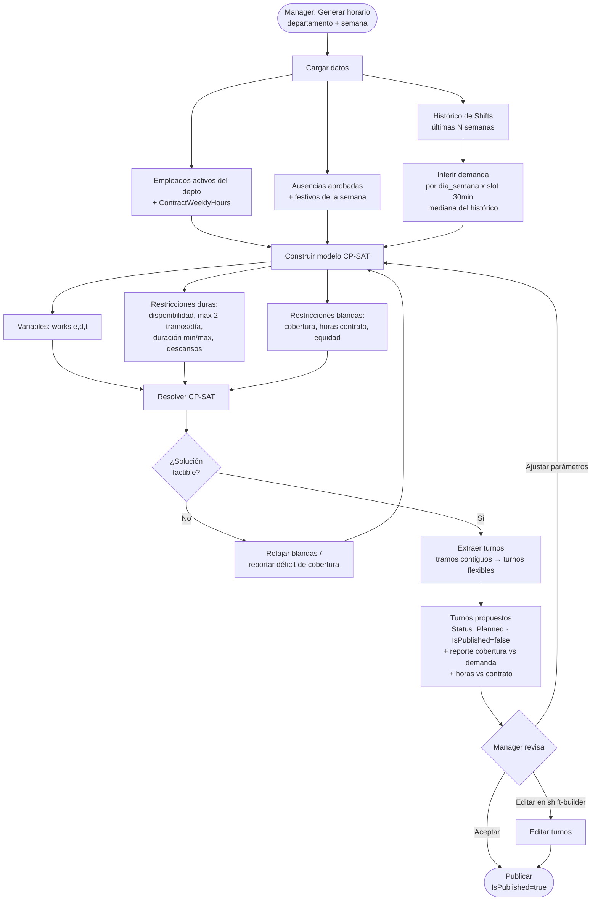
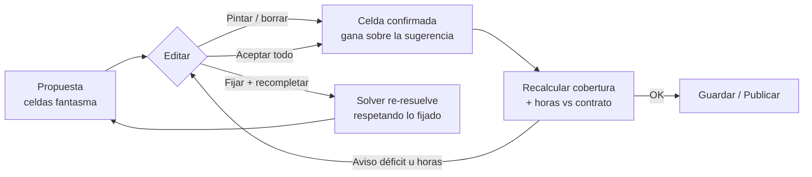

# Agente offline de generación de horarios (auto-scheduler)

Diseño de un generador automático de turnos **100% offline y sin LLM**, basado en
un solver de restricciones (OR-Tools CP-SAT). Propone cuadrantes que el manager
revisa, ajusta y publica con la UI existente.

## Decisiones de diseño (fijadas)

| Tema | Decisión |
|------|----------|
| Tecnología | **OR-Tools CP-SAT** (optimización con restricciones). **Sin LLM.** |
| Demanda de personal | **Inferida del histórico** de `Shifts`. |
| Turnos | **Inicio/fin flexibles**; **hasta 2 turnos por día** (turno partido). |
| Rol del motor | **Propone** (`Status=Planned`, `IsPublished=false`); el humano publica. |
| Ejecución | Local, dentro del backend FastAPI. Determinista y reproducible. |

## Por qué un solver y no un LLM

La generación de horarios es un problema de **optimización con restricciones duras**
(cobertura, no solapar, horas de contrato exactas, descansos). Un LLM no garantiza
esas restricciones; un solver CP-SAT sí, y además es offline, gratuito y rápido para
equipos pequeños (2–10 personas por tienda, 1 semana → segundos).

## Datos existentes que se reutilizan

- **`Shifts`** — histórico de turnos (para inferir demanda) y destino de la salida.
- **`UserDetail.ContractWeeklyHours`** — objetivo de horas semanales por empleado.
- **`UserDepartments`** (con periodos `AssignedDate`/`DeAssignedDate`) — quién pertenece a cada tienda y cuándo.
- **`AbsenceRequests`** aprobadas + **`Holidays`** — días no disponibles.
- **`Departments` / `Locations`** — tiendas y su horario de apertura (derivable del histórico).

No se requieren tablas nuevas para el POC (la demanda se calcula al vuelo). Ver
"Evolución" para persistir demanda/preferencias más adelante.

## Diagrama de flujo



## 1. Inferencia de demanda

Objetivo: obtener, por `(departamento, día_de_semana, slot)`, cuántas personas suelen
estar trabajando a la vez.

Algoritmo:
1. Tomar las últimas **N semanas** de `Shifts` del departamento (por defecto 8–12).
2. Discretizar el día en **slots de 30 min** dentro del horario de apertura
   (apertura = mín. `StartTime` / máx. `EndTime` observados en el depto).
3. Para cada `(día_de_semana, slot)`: contar personas activas en cada fecha concreta
   y quedarse con un estadístico robusto (**mediana** o percentil configurable) sobre
   las fechas de ese día de semana.
4. Resultado: matriz `demanda[dept][weekday][slot] = headcount objetivo`.

El histórico real ya muestra el patrón de turno partido (dos picos: mañana y tarde,
valle al mediodía), distinto por día de la semana, así que la demanda es fiable.

> Nota: la demanda inferida es un **punto de partida**. En fases siguientes el manager
> podrá ajustarla manualmente (subir/bajar cobertura por tienda/slot).

## 2. Modelo del solver (CP-SAT)

Horizonte: una semana, un departamento (se resuelve tienda a tienda).

**Variables**
- `works[e, d, t] ∈ {0,1}`: el empleado `e` trabaja el día `d` en el slot `t` (30 min).
- Turnos flexibles y turno partido se derivan de tramos contiguos de `works=1`
  (ver restricciones de contigüidad).

**Restricciones duras**
- **Disponibilidad:** `works[e,d,t]=0` si `e` está de ausencia aprobada ese día, es
  festivo, el slot cae fuera de apertura, o `e` no está asignado al depto en esa fecha.
- **Contigüidad y nº de turnos:** los slots activos de `e` en el día `d` forman **como
  máximo 2 tramos** contiguos (turno partido), con **hueco mínimo** entre ambos.
- **Duración de turno:** cada tramo `≥` duración mínima (p.ej. 3h) y `≤` máxima (p.ej. 8h).
- **Un turno a la vez:** un empleado no puede estar en dos tramos solapados (implícito por slot).
- **Descanso entre días** y **máx. días consecutivos** trabajados.

**Restricciones blandas (penalizadas en el objetivo)**
- **Cobertura:** `Σ_e works[e,d,t] ≈ demanda[dept][weekday(d)][t]` → penalizar déficit
  (peor) y exceso.
- **Horas de contrato:** `Σ_{d,t} works[e,d,t] · 0.5h ≈ ContractWeeklyHours[e]` (±margen).
- **Equidad:** repartir carga/fines de semana de forma pareja entre empleados.

**Objetivo (minimizar)**
```
w1·déficit_cobertura + w2·exceso_cobertura
+ w3·desviación_horas_contrato + w4·injusticia
```
Los pesos `w1..w4` son configurables (la cobertura suele pesar más).

## Edición de la propuesta (control humano)

La propuesta **no es un bloque cerrado**: se materializa como pre-pintado de la misma rejilla
del constructor de horarios, así que se edita con las herramientas de siempre.

**Modelo de datos en el modal**
- `gridCells` — celdas **confirmadas** (lo que se guardará como `Shifts`).
- `suggestedCells` — celdas **fantasma** (la propuesta, estilo trama/discontinuo).
- Al **tocar** una celda fantasma (pintar/borrar), pasa a `gridCells` → **la edición manual gana**.

**Operaciones de edición** (drag `fill`/`empty` existente)
- Alargar/acortar turno (pintar/borrar celdas), crear/eliminar turno, reasignar a otro empleado
  (pintar en otra fila), mover un bloque.

**Feedback en vivo** — cada cambio recalcula el reporte:
- déficit de cobertura por franja (*"Sáb 17:00–19:00 sin cubrir"*),
- horas vs contrato (*"María: 38 h / contrato 35 h"*),
- cobertura % global.

**Fijar y recompletar** — el manager "clava" las celdas que tocó y pide regenerar; esas celdas
se envían al solver como **restricciones duras** (`works[e,d,t]` forzado a 1/0) y el motor rellena
el resto respetándolas. También: **regenerar todo**, **deshacer/rehacer**.

Nada se persiste hasta **Guardar/Publicar**.



## 3. Arquitectura / módulos

Nuevo paquete `app/scheduling/`:

```
app/scheduling/
├── demand.py     # infiere demanda[dept][weekday][slot] del histórico
├── model.py      # construye el modelo CP-SAT (variables + restricciones + objetivo)
├── solver.py     # resuelve y traduce la solución a turnos propuestos
├── service.py    # orquesta: carga datos → demanda → solver → Shifts propuestos
└── config.py     # parámetros por defecto (slot, min/max turno, pesos, N semanas)
```

Integración:
- Endpoint **`POST /api/shifts/generate`** — parámetros: `department_id`, `week_number`,
  `year`, (opcional) overrides de parámetros. Devuelve los turnos propuestos.
- Los turnos se crean con `Status=Planned`, `IsPublished=false`, `CreatedBy=<manager>`.
- El manager los revisa/edita/publica en el **shift-builder** ya existente.

**Dependencia nueva:** `ortools` (añadir a `requirements.txt`). Sin llamadas de red.

## 4. Parámetros configurables (`config.py`)

| Parámetro | Default | Descripción |
|-----------|---------|-------------|
| `SLOT_MINUTES` | 30 | Granularidad temporal |
| `MIN_SHIFT_HOURS` | 3 | Duración mínima de un tramo |
| `MAX_SHIFT_HOURS` | 8 | Duración máxima de un tramo |
| `MAX_SHIFTS_PER_DAY` | 2 | Turnos por día (partido) |
| `MIN_SPLIT_GAP_HOURS` | 1 | Hueco mínimo entre los 2 tramos |
| `CONTRACT_TOLERANCE` | 0.10 | Margen sobre horas de contrato (±10%) |
| `HISTORY_WEEKS` | 12 | Semanas de histórico para inferir demanda |
| `DEMAND_STAT` | median | Estadístico de agregación (median/p75/…) |
| `MAX_CONSECUTIVE_DAYS` | 6 | Máx. días seguidos |
| pesos `w1..w4` | (cobertura ≫ resto) | Pesos del objetivo |

## 5. Salida y validación

- Lista de turnos propuestos por empleado/día (inicio, fin, tramos).
- **Reporte de cobertura vs demanda** por slot (déficit/exceso).
- **Resumen de horas** por empleado vs su contrato.
- El manager decide: aceptar, editar o regenerar con otros parámetros.

## 6. Plan de fases

1. **POC (solver aislado)** — módulo `app/scheduling/` que resuelve **1 tienda / 1 semana**
   con datos reales (Depto 5), respetando demanda + contrato + ausencias + ≤2 turnos/día.
   Salida a consola/JSON (sin tocar la BD). *Objetivo: validar el enfoque.*
2. **Integración backend** — endpoint `POST /api/shifts/generate` que persiste turnos
   propuestos (`Planned`, no publicados).
3. **Integración frontend** — botón "Generar horario" en el shift-builder → revisar/publicar.
4. **(Opcional) Ajustes** — demanda editable por el manager, preferencias/disponibilidad
   del empleado, equidad avanzada, resolución multi-tienda.

## Refinamientos del solver (checklist)

Mejoras para acercar la propuesta a la realidad operativa. Se irán afinando de forma
incremental; marcar cada punto al completarlo.

**A. Calidad del reparto**
- [ ] **A1 · Equidad del exceso** — cuando las horas contratadas superan la demanda, el exceso se
  concentra en pocos días; penalizar la varianza entre días/empleados para repartirlo.
- [ ] **A2 · Hueco mínimo real en turno partido** — forzar ≥1h (configurable) entre los dos tramos.
- [ ] **A3 · Equidad de fines de semana y descansos** — repartir sábados/domingos y garantizar N días
  libres (idealmente consecutivos) por empleado.

**B. Reglas y bienestar**
- [ ] **B1 · Descanso mínimo entre jornadas** — X horas entre el fin de un día y el inicio del siguiente.
- [ ] **B2 · Convenio/legal** — tope de horas semanales, descansos obligatorios, máx. días seguidos.
- [ ] **B3 · Estabilidad semana a semana** — penalizar cambios bruscos respecto a la semana anterior.

**C. Datos y demanda**
- [ ] **C1 · Percentil configurable** — usar p75/p90 en vez de mediana para cubrir mejor los picos.
- [ ] **C2 · Demanda desde fichajes reales** — calibrar con `WorkLogs` (lo trabajado), no solo turnos
  planificados, para acercar la demanda a la realidad.
- [ ] **C3 · Demanda editable** — que el manager ajuste la cobertura objetivo por tienda/franja.

**D. Preferencias y alcance**
- [ ] **D1 · Disponibilidad/preferencias** del empleado (días/horas que no puede o no prefiere, turno favorito).
- [ ] **D2 · Coste/categorías** — minimizar coste por hora; garantizar un perfil (p.ej. responsable) por franja.
- [ ] **D3 · Multi-tienda** — empleados compartidos; resolver varias tiendas sin solapar a una persona.

**E. Control y explicabilidad**
- [ ] **E1 · Fijar y recompletar** — el manager clava celdas y el solver re-resuelve respetándolas
  (restricciones duras). Requiere aceptar `pinned_cells` en el endpoint.
- [ ] **E2 · Explicabilidad del déficit** — indicar qué restricción impide cubrir cada franja.

> Prioridad sugerida para máximo impacto/esfuerzo: **C1 (percentil)** y **A1 (equidad del exceso)**
> mejoran la calidad percibida al instante; **E1 (fijar y recompletar)** cierra el control humano.

## 7. Supuestos y limitaciones

- Un empleado pertenece a **una tienda** por periodo (el modelo resuelve por tienda).
  Empleados compartidos entre tiendas quedan para una fase posterior (multi-tienda).
- La **disponibilidad/preferencias** individuales no están modeladas hoy; el POC usa
  solo contrato + ausencias. Añadirlas es una extensión natural.
- La demanda inferida asume que el patrón histórico es representativo; festivos y picos
  puntuales pueden requerir ajuste manual.
- El motor **propone**; la decisión final y la publicación son del manager.
